# <div align="center"> Hello !! I'm Abhijeet Khomane</div>
# <div align="center"> ELECTRONIC & COMPUTER ENGINEER </div>

<div align="center">
  
  **Data Analytics  | AI & IoT Innovator | Business Intelligence Enthusiast**
  
  

</div>

---

## 📊 Professional Dashboard

<div align="center">

### 🎯 **Career Status Overview**

| Metric | Status | Level |
|--------|--------|-------|
| **👨‍🎓 Education** |  | Final Year |
| **📊 Analytics** |  | Intermediate |
| **☁️ Cloud** |  | Intermediate |
| **🎖️ Hackathon** |  | Achievement |

</div>

---

## 🎓 Education & Certification Timeline

```mermaid
timeline
    title 🎓 Academic & Professional Journey
    2022 - 2026 : B.Tech ECE<br>Modern College of Engineering<br>CGPA: 8.5/10
    2025 (Jan-Mar) : Data Analyst Intern<br>KasNet Technologies
    2025 (May) : AIZureStack Hackathon<br>Runner-Up Position
    2025 : Microsoft Azure<br>Fundamentals (AZ-900)
    2025 : Plant Disease Detection<br>IoT Project Completion
    2025 (Dec) : Crypto Sentiment<br>Analysis Project
    2026 : Expected Graduation<br>& Full-time Opportunities
```



---

## 🏆 Project Portfolio Showcase

<div align="center">

### **Featured Projects**

| Project | Timeline | Tech Stack | Impact | Status |
|---------|----------|------------|--------|--------|
| **🌿 IoT Plant Disease Detection** | May 2025 |   | 90%+ accuracy, 60% time reduction | ✅ Completed |
| **📈 Global Sales Analysis** | Feb 2025 |   | 90% growth identified | ✅ Completed |
| **💰 Crypto Sentiment Analysis** | Dec 2025 |   | 211K+ trades analyzed | ✅ Completed |
| **📊 KasNet Internship Dashboards** | Jan-Mar 2025 |   | 95% data accuracy improvement | ✅ Completed |


---

## 🛠️ Technical Stack Breakdown

<div align="center">

### **📊 Business Intelligence & Analytics**


### **🐍 Python & Data Science**


### **💾 Databases**


### **🌐 Web & IoT**


### **☁️ Cloud & Tools**


</div>


---

## 🏅 Certifications & Achievements

<div align="center">

| Certification/Award | Issuer | Year | Status |
|-------------------|--------|------|--------|
| **Microsoft Azure Fundamentals (AZ-900)** | Microsoft | 2025 |  |
| **AIZureStack Hackathon Runner-Up** | AI & Azure Stack | 2025 |  |
| **Java, C++, RDBMS Certifications** | IIT Bombay (Spoken Tutorial) | 2024-25 |  |

### **Academic Excellence**


</div>


---

## 📊 GitHub Analytics

<div align="center">

### **Repository Breakdown**

```text
┌─────────────────────────────────────────────────────────────────────┐
│                     PROJECT DISTRIBUTION BY TYPE                    │
├─────────────────────────────────────────────────────────────────────┤
│ Data Analytics    ████████████████████████████████░░░░   70% (8)    │
│ IoT Projects      ████████████░░░░░░░░░░░░░░░░░░░░░░░░░   25% (3)   │
│ Web Development   ████░░░░░░░░░░░░░░░░░░░░░░░░░░░░░░░░░   10% (1)   │
│ Hackathons        ███░░░░░░░░░░░░░░░░░░░░░░░░░░░░░░░░░░    8% (1)   │
│ Others            ██░░░░░░░░░░░░░░░░░░░░░░░░░░░░░░░░░░░    5% (1)   │
└─────────────────────────────────────────────────────────────────────┘
```

### **Project Metrics**
| Metric | Count | Trend |
|--------|-------|-------|
| **Total Projects** |  | ↗️ Increasing |
| **Stars Received** |  | ↗️ Growing |
| **Forks** |  | ↗️ Active |
| **Contributions** |  | ↗️ Consistent |

</div>

---

## 🤝 Let's Connect & Collaborate

<div align="center">

### **📬 Professional Contact**
[](mailto:abhikhomane123@gmail.com)
[](https://www.linkedin.com/in/abhijeet-khomane-08a202275/)
[](https://github.com/Abhikhomane45)
[](tel:+917666200956)

### **📍 Location & Availability**


</div>


<div align="center">


<div align="center">
  
  **✨ Building the future, one line of code at a time ✨**
  
  
  
</div>

</div>
